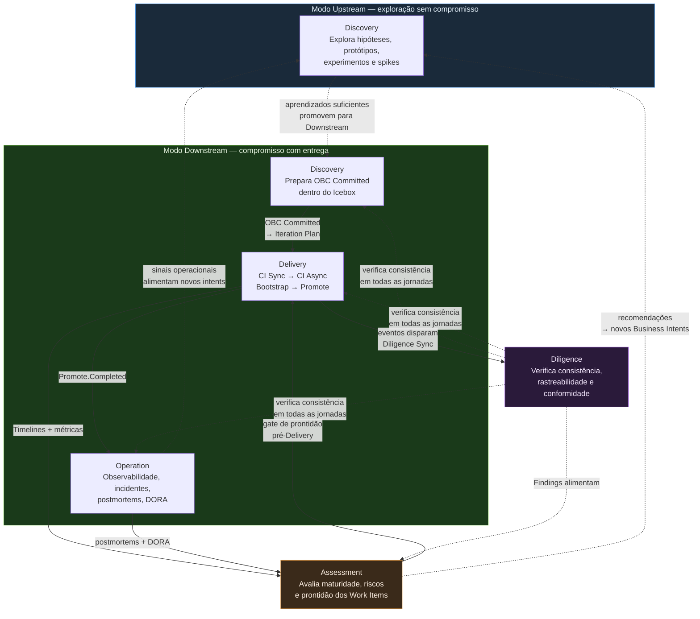

# Jornadas

O Framework ProdOps possui cinco jornadas organizadas em dois grupos.

---

## Separação fundamental

**Modos de execução não são jornadas.**

| Conceito | O que é | Exemplo |
|---|---|---|
| **Modo** | Determina o nível de compromisso e os quality gates aplicados | Upstream, Downstream |
| **Jornada** | Descreve o caminho de trabalho dentro de um modo | Discovery, Delivery, Operation |
| **Backlog** | Organiza o trabalho antes e durante a execução | Product Backlog, Icebox, Iteration Backlog |
| **Plano** | Registra a execução de uma iteração | Iteration Plan |

Upstream e Downstream são modos, não jornadas. A Discovery é a jornada — ela existe em ambos os modos com responsabilidades diferentes.

---

## Responsabilidade de cada jornada

| Jornada | Responsabilidade única |
|---|---|
| [Discovery](discovery/) | Reduzir incertezas e preparar o trabalho |
| [Delivery](delivery/) | Construir, validar e promover a solução |
| [Operation](operation/) | Operar e evoluir o produto em produção |
| [Assessment](assessment/) | Produzir análises para apoiar decisões |
| [Diligence](diligence/) | Garantir a consistência do sistema de trabalho do ProdOps |

---

## Relacionamento entre jornadas



---

## Fluxo Upstream

```
Intent
  ↓
Upstream
  ↓
Discovery (exploratório)
  ↓
Aprendizados / Protótipos / Experimentos
  ↓
(Eventualmente) → Downstream
```

Não existe compromisso de entrega. O objetivo é reduzir incerteza. Uma Intent pode permanecer indefinidamente no Upstream, ser descartada, retornar ao Portfolio ou seguir para Downstream.

---

## Fluxo Downstream

```
Intent
  ↓
Product Backlog
  ↓
Icebox (Discovery preparatória)
  ↓
Iteration Backlog
  ↓
Iteration Plan
  ↓
Delivery (CI Sync → CI Async)
  ↓
Operation
```

Existe compromisso de entrega, validação, governança e confiabilidade.

---

## Relação entre jornadas e backlogs

| Backlog | Responsável |
|---|---|
| Portfolio Tracking List | Portfolio (Assessment sinaliza) |
| Product Tracking List | Product Owner (Assessment sinaliza) |
| Product Backlog | Product Owner gerencia; Diligence sincroniza consistência |
| Icebox | Discovery (Downstream) — preparação |
| Iteration Backlog | Product Owner + Diligence |
| Iteration Plan | Delivery — execução |

O **Product Backlog** é gerenciado pelo Product Owner. A Diligence sincroniza o estado dos artefatos e das ferramentas — não gerencia o backlog. A Diligence garante consistência; a priorização é responsabilidade do Product Owner.

A Discovery no Downstream opera dentro do Icebox.
A Delivery começa somente quando um item entra no Iteration Plan.

---

## Jornadas transversais

Assessment e Diligence acompanham continuamente as demais jornadas. Não representam apenas documentação — representam comportamento ativo do Framework.

Assessment pode ocorrer tanto no Upstream quanto no Downstream.

### Diligence — natureza transversal

A Diligence não é uma etapa linear ao final do fluxo. É transversal: verifica consistência, rastreabilidade, completude e conformidade em todas as jornadas simultaneamente.

```
                    DISCOVERY
                        │
                        ▼
                    ASSESSMENT
                        │
                        ▼
                     DELIVERY
                        │
                        ▼
                    OPERATION
                        │
                        └──────────┐
                                   │
DILIGENCE ─────────────────────────┤
                                   │
verifica consistência,             │
rastreabilidade, completude        │
e conformidade em todas            │
as jornadas                        │
                                   ▼
                              novos sinais,
                              decisões e trabalho
```

**Questão central da Diligence:** O conhecimento, as decisões, a execução e as evidências continuam coerentes e rastreáveis?

A Diligence opera em exatamente dois ciclos:
- **diligence-sync** — síncrono, reativo, contextual, ligado a uma operação em andamento
- **diligence-async** — assíncrono, proativo, para detecção de drift acumulado

Capabilities como Workspace Reconciliation são sub-rotinas consumidas pelos ciclos — não são ciclos independentes.

→ [Diligence — especificação completa](diligence/README.md)
→ [Execution Model](../execution-model/README.md)
→ [Hierarquia de backlogs](../backlogs.md)
